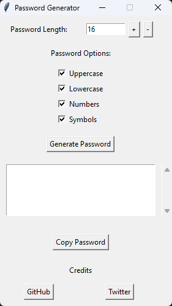

# 🔑Password Generator🔑
⭐This is a password generator with UI, I use only Python to create it and turn it into exe by Pyinstaller.

- Because It has only one file no need to install just open it.

- It has GUI and you only need to click generate button to generate password then click "Copy Password" buttion.

 
  

  &#xa0;

# Thanks to Tester
- [@RichterYT](https://github.com/RichterYT)

> If it has any bug you can dm me in discord : **itdragclick**
